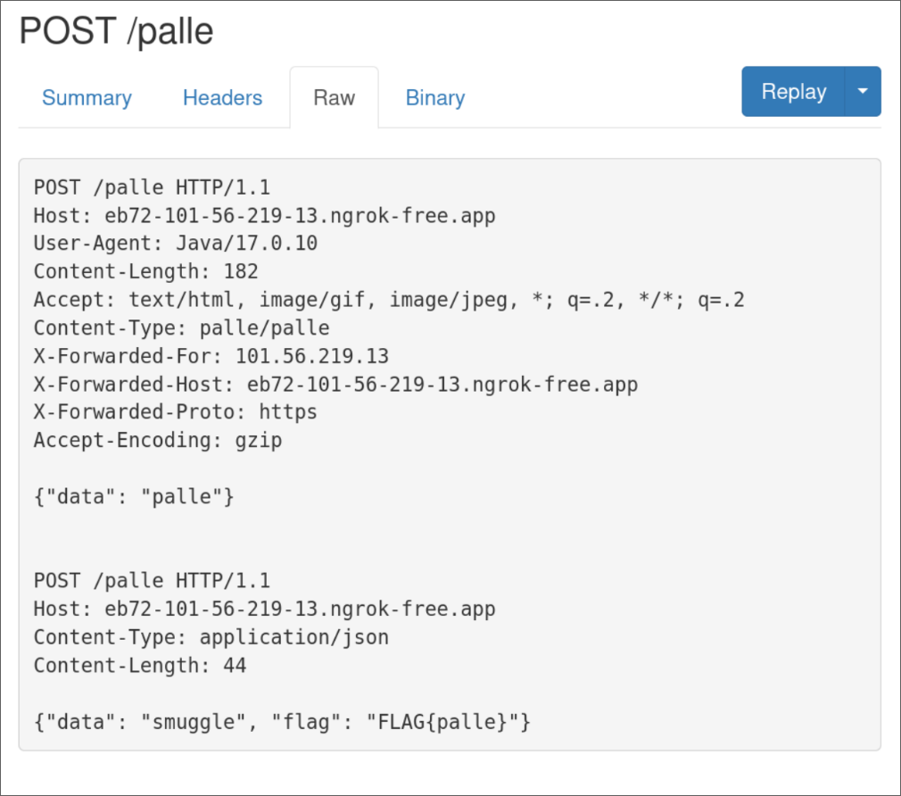

## TLDR
The challenge consisted in exploiting a **race condition** by using **DNS rebinding** to bypass `URL.equals()` check in Java. 

## Description
> I made a service to convert webhooks into webhooks.

## Source code analysis
Upon extracting the challenge attachments, it will present itself as a Kotlin-based Spring Boot application with minimal code support.  
In fact the only relevant files to us are `WebwebhookhookApplication.kt` , `State.kt` and `controller/MainController.kt`.

**State.kt**
```kotlin {lineNos=inline}
package tf.irisc.chal.webwebhookhook

import java.net.URI
import java.net.URL

class StateType(
        hook: String,
        var template: String,
        var response: String
        ) {
    var hook: URL = URI.create(hook).toURL()
}

object State {
    var arr = ArrayList<StateType>()
}
```
The `StateType` class is being defined to store an `hook` URL, a mutable `template` string and a mutable `response` string. Note that in the constructor, the `hook` declaration is being shadowed by `var hook: URL = URI.create(hook).toURL()`, meaning that it will accept hook parameter as string but it'll be casted as an `URL` object immediately.  
The `StateType` class is later used as Collection argument for `ArrayList` stored inside `State.arr`.  
The `State` object is defined as singleton, meaning there is exactly one instance of `State` in the entire application.  
This pattern effectively gives the application a simple in-memory database of all registered hooks and their associated templates.

**WebwebhookhookApplication.kt**
```kotlin {lineNos=inline}
package tf.irisc.chal.webwebhookhook

import org.springframework.boot.autoconfigure.SpringBootApplication
import org.springframework.boot.runApplication

@SpringBootApplication
class WebwebhookhookApplication

const val FLAG = "irisctf{test_flag}";

fun main(args: Array<String>) {
    State.arr.add(StateType(
            "http://example.com/admin",
            "{\"data\": _DATA_, \"flag\": \"" + FLAG + "\"}",
            "{\"response\": \"ok\"}"))
    runApplication<WebwebhookhookApplication>(*args)
}
```
This is the main entry point for the Application. Here an entry is being added in the global `State` object, using: 
- `http://example.com/admin` as value for the `hook` parameter.
- `{"data": _DATA_, "flag": "irisctf{test_flag}"}` as value for the `template` string.
- `{"response": "ok"}` as value for the `response` string.  

Let's analyze the application further to understand how we might be able to read that flag.

**controller/MainController.kt**
```kotlin {lineNos=inline}
package tf.irisc.chal.webwebhookhook.controller

import org.springframework.http.MediaType
import org.springframework.stereotype.Controller
import org.springframework.ui.Model
import org.springframework.web.bind.annotation.*
import tf.irisc.chal.webwebhookhook.State
import tf.irisc.chal.webwebhookhook.StateType
import java.net.HttpURLConnection
import java.net.URI

@Controller
class MainController {

    @GetMapping("/")
    fun home(model: Model): String {
        return "home.html"
    }

    @PostMapping("/webhook")
    @ResponseBody
    fun webhook(@RequestParam("hook") hook_str: String, @RequestBody body: String, @RequestHeader("Content-Type") contentType: String, model: Model): String {
        var hook = URI.create(hook_str).toURL();
        for (h in State.arr) {
            if(h.hook == hook) {
                var newBody = h.template.replace("_DATA_", body);
                var conn = hook.openConnection() as? HttpURLConnection;
                if(conn === null) break;
                conn.requestMethod = "POST";
                conn.doOutput = true;
                conn.setFixedLengthStreamingMode(newBody.length);
                conn.setRequestProperty("Content-Type", contentType);
                conn.connect()
                conn.outputStream.use { os ->
                    os.write(newBody.toByteArray())
                }

                return h.response
            }
        }
        return "{\"result\": \"fail\"}"
    }

    @PostMapping("/create", consumes = [MediaType.APPLICATION_JSON_VALUE])
    @ResponseBody
    fun create(@RequestBody body: StateType): String {
        for(h in State.arr) {
            if(body.hook == h.hook)
                return "{\"result\": \"fail\"}"
        }
        State.arr.add(body)
        return "{\"result\": \"ok\"}"
    }
}
```
The router for the Spring Boot Application is configured to have the `/create` and the `/webhook` endpoints.
1) The `/create` endpoint accepts `POST` requests with `application/json` body that will be casted as `StateType`. Then it checks if an entry with same hook is already occurring in the global `State` object, and if so, it will return a json response of `{"result": "fail"}`. After iterating the `ArrayList`, if no matching instances were found, a new `StateType` entry will be appended.  
Essentially, this endpoint registers a new webhook configuration, unless it already exists.
2) The `/webhook` endpoint will accept `POST` requests with a `hook` parameter. It will iterate over the `State.arr` global list of previously created webhook configurations, and if it finds a matching `hook` URL, it will replace the `_DATA_` placeholder in the template with the content of the supplied body, and send a POST request to the given `hook` URL using `HttpURLConnection` with the new body. If the `hook` URL is not found in the `State.arr`, it will return a json response of `{"result": "fail"}`.

**Note** that both the endpoints do not provide SSRF protections, however it's irrelevant for us as there are no additional services running on the server.

## Identifying the vulnerability
At first glance, there doesn't seem to be an obvious way to intercept the flag, since the only way would be to successfully match the check hook and send the `POST` to `example.org`, which would be ez game if we were the admins of domain, which is not the case :P.  
One of my first steps was to try an HTTP smuggling, given the arbitrary control over the body that then replaces the content of `_DATA_`, to build a request like this:



However, we note how the body of the request is correctly set based on the length of our payload at L31 with `conn.setFixedLengthStreamingMode(newBody.length)` consequently failing to delimit the stream of the request to build a new one. Furthermore, it is not possible to override the request headers and in any case it would be a matter of exploiting a Spring Boot HTTP desync but today will not be the day of 0-days :/

Finally, in a scenario of arbitrary write in the system we could have tried to overwrite `/etc/hosts` to override the DNS resolution of `example.org` and make it point to an IP under our control, but again, this is not the case for the challenge.


## Exploitation

---
`irisctf{url_equals_rebind}`